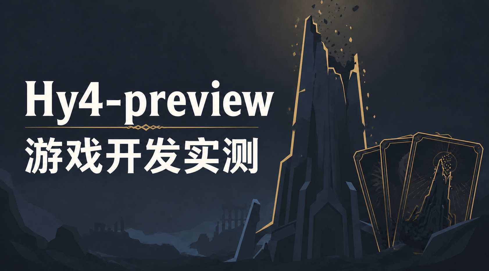
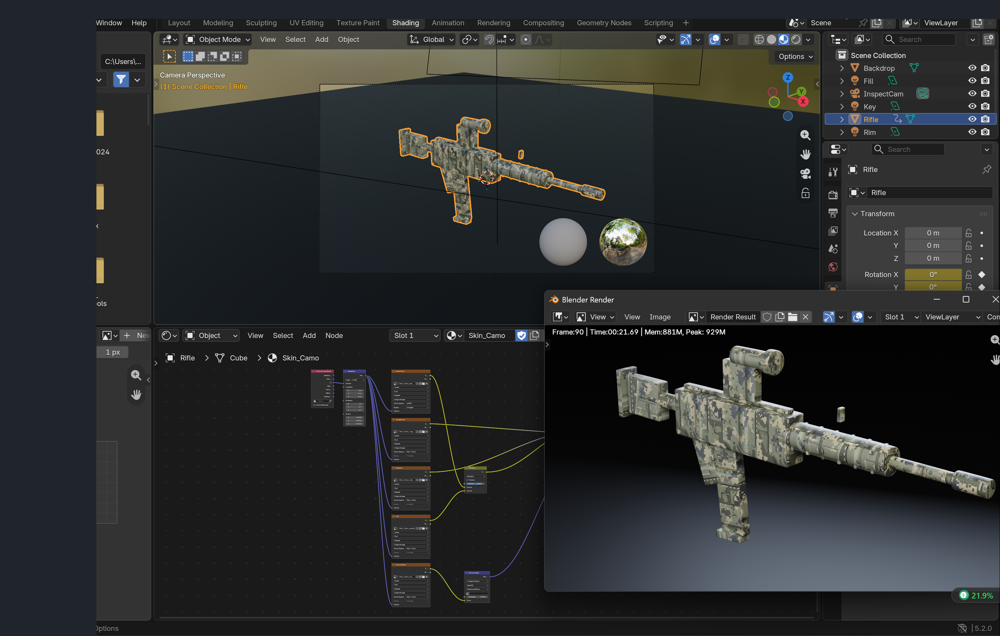
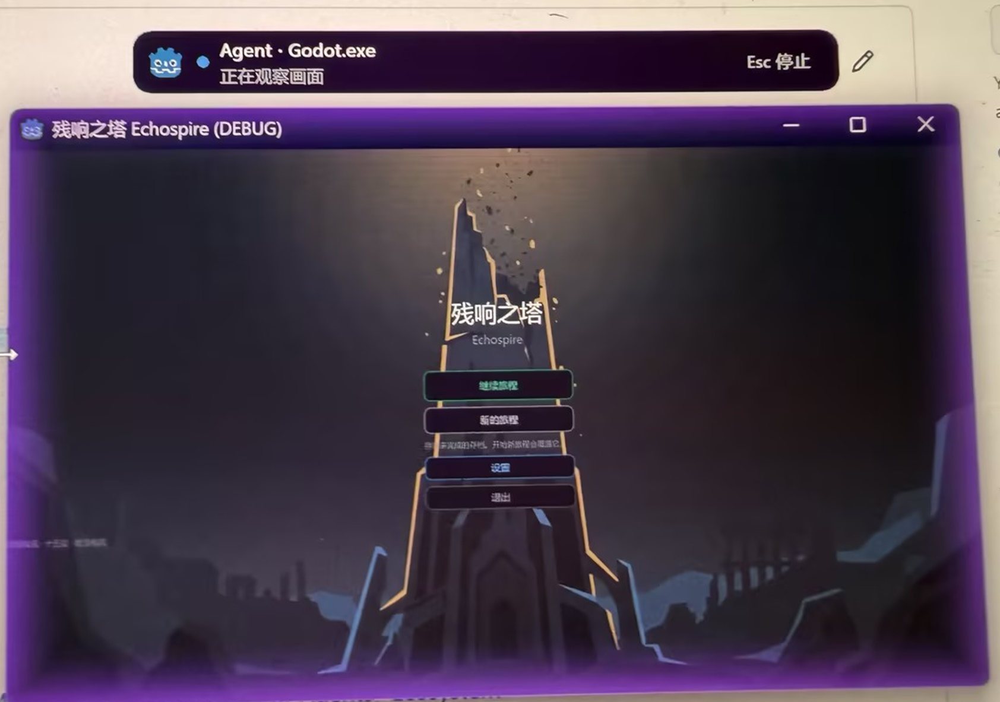

# Hy4 Preview

This preview follows one development exercise from a deckbuilding roguelike
brief to a Blender rifle-inspection case. The first prompt lays out the game,
its data-driven architecture, and its test plan. The second turns a procedural
rifle into a short material-and-animation study.

## Effect image

The rifle skin is generated with Image Gen for a PBR-oriented material pass.
The image keeps the Blender viewport, shader nodes, and render result together.

## Godot demo

This capture records `dcc-cua` observing and debugging the running Godot game
interface. The public integration context is the [DCC-MCP Godot adapter](https://github.com/dcc-mcp/dcc-mcp-godot).

## Prompts

- [Deckbuilding roguelike agent task prompt](materials/card-roguelike-agent-prompt.md)
- [Rifle inspection case — public prompt](materials/blender-rifle-inspect-prompt.md)

## Videos

**Rifle inspection turntable · 3 seconds**

[Watch rifle turntable](https://media.githubusercontent.com/media/loonghao/Hy4-preview/feat/hy4-echospire-banner-materials/media/rifle-inspect-turntable.mp4)

<video controls preload="metadata" width="100%">
  <source src="https://media.githubusercontent.com/media/loonghao/Hy4-preview/feat/hy4-echospire-banner-materials/media/rifle-inspect-turntable.mp4" type="video/mp4">
  [Download the rifle inspection turntable](media/rifle-inspect-turntable.mp4)
</video>

**Card roguelike gameplay · 8 minutes 11 seconds**

[Watch card roguelike gameplay](https://media.githubusercontent.com/media/loonghao/Hy4-preview/feat/hy4-echospire-banner-materials/media/card-roguelike-gameplay.mp4)

<video controls preload="metadata" width="100%">
  <source src="https://media.githubusercontent.com/media/loonghao/Hy4-preview/feat/hy4-echospire-banner-materials/media/card-roguelike-gameplay.mp4" type="video/mp4">
  [Download the card roguelike gameplay](media/card-roguelike-gameplay.mp4)
</video>

## Stack

WorkBuddy and Tencent Hy4 preview form the authoring workflow. The public
[DCC-MCP Godot adapter](https://github.com/dcc-mcp/dcc-mcp-godot) covers the
game side; the public [DCC-MCP Blender adapter](https://github.com/dcc-mcp/dcc-mcp-blender)
covers the rifle case. Official context: [Tencent Hunyuan Hy4 Preview](https://hunyuan.tencent.com/research/hy4-preview).
